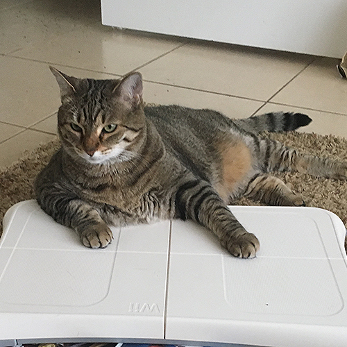

<!doctype html>
<html>
<head>
<meta charset="UTF-8">
<title>Cats</title>
	
</head>

<body>
	<h1>Cats</h1>
	
Cats are the spirit animal of the internet.
 
	<h3>Famous Cats</h3>
	<ul>
		<li>Felix</li>
		<li>Garfield</li>
		<li>Grumpy Cat</li>
	</ul>
	<h3>Cool House Cats</h3>
	
	<h5><em>Flynn: Happy Kitty, Sleepy Kitty!</em></h5>
	
	<h5><em>Quorra: Mii-ow Fit!</em></h5>
	
<h3>Cat Shopping List</h3>
	<table>
		<tr>
			<td><strong>Item</strong></td>
			<td><strong>Price</strong></td>
		</tr>
		<tr>
			<td>Raw Tuna</td>
			<td>$5</td>
		</tr>
		<tr>
			<td>Organic Catnip</td>
			<td>$3</td>
		</tr>
	</table>
</body>
</html>
